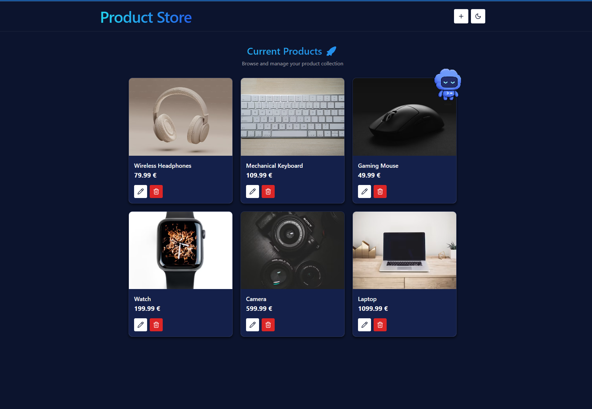

# 🚀 Product Store

A full-stack MERN product management application built during my software development internship to practice modern React and Express development.



## Features

- Create, update, and delete products
- Store custom product image URLs
- Select from sample product images
- Default image when no image is provided
- Restore sample products when the store is empty
- Responsive light and dark modes
- Loading, error, and empty states
- REST API with input validation
- API rate limiting and request size limits
- MongoDB persistence

## Tech Stack

### Frontend

- React
- Vite
- React Router
- Zustand
- Chakra UI

### Backend

- Node.js
- Express
- MongoDB
- Mongoose

## Project Structure

```text
MERN-product-store/
├── backend/
│   ├── config/
│   ├── controllers/
│   ├── models/
│   ├── routes/
│   └── server.js
├── frontend/
│   ├── public/
│   └── src/
├── docs/
│   └── product-store.png
├── .env.example
├── package.json
└── README.md
```

## Running Locally

### 1. Install backend dependencies

From the project root:

```bash
npm install
```

### 2. Install frontend dependencies

```bash
cd frontend
npm install
```

### 3. Configure environment variables

Create a `.env` file in the project root:

```env
MONGO_URI=your_mongodb_connection_string
PORT=5000
NODE_ENV=development
```

### 4. Start the backend

From the project root:

```bash
npm run dev
```

### 5. Start the frontend

From the `frontend` directory:

```bash
npm run dev
```

The Vite development server proxies `/api` requests to the Express backend.

## Production

The React application is built with Vite and served by the Express server in production.

Build the frontend:

```bash
cd frontend
npm run build
```

Then start the Express server from the project root with `NODE_ENV=production`:

```bash
npm start
```

## Live Demo

A deployed version will be available here after deployment.

## Purpose

This project was created as a learning project during my software development internship.

The goal was to build a small full-stack application while practicing the connection between a modern React frontend, a REST API built with Express, and persistent data stored in MongoDB.